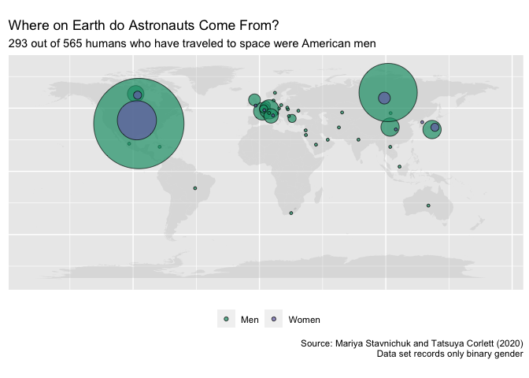

Astronauts
================

``` r
#Load the needed libraries 
library(tidyverse)
```

    ## ── Attaching packages ─────────────────────────────────────────────────────────────────────────────── tidyverse 1.3.0 ──

    ## ✓ ggplot2 3.3.2     ✓ purrr   0.3.4
    ## ✓ tibble  3.0.3     ✓ dplyr   1.0.0
    ## ✓ tidyr   1.1.0     ✓ stringr 1.4.0
    ## ✓ readr   1.3.1     ✓ forcats 0.5.0

    ## ── Conflicts ────────────────────────────────────────────────────────────────────────────────── tidyverse_conflicts() ──
    ## x dplyr::filter() masks stats::filter()
    ## x dplyr::lag()    masks stats::lag()

``` r
library(tidytuesdayR)
library(maps)
```

    ## 
    ## Attaching package: 'maps'

    ## The following object is masked from 'package:purrr':
    ## 
    ##     map

``` r
library(CoordinateCleaner)
```

    ## Warning: package 'CoordinateCleaner' was built under R version 4.0.2

``` r
data(countryref)

#Import a world map
world <- map_data("world")

#Get the latitude and longitude of each country's central point
countries <- as_tibble(countryref) %>%
        distinct(name, .keep_all = TRUE) %>%
        rename(nationality = name,
               long = centroid.lon,
               lat = centroid.lat)

#Get the astronaut data set
tuesdata <- tidytuesdayR::tt_load('2020-07-14')
```

    ## --- Compiling #TidyTuesday Information for 2020-07-14 ----

    ## --- There is 1 file available ---

    ## --- Starting Download ---

    ## 
    ##  Downloading file 1 of 1: `astronauts.csv`

    ## --- Download complete ---

``` r
#Wrangle these data
astronauts <- tuesdata$astronauts %>%
        select(number, name, sex, nationality) %>%
        #The names of nationalities are inconsistent with country data
        #Choose presently existing countries, fix spelling errors, and 
        #otherwise make consistent
        mutate(
                nationality = if_else(nationality == "U.S.S.R/Russia", "Russia", 
                                      nationality),
                nationality = if_else(nationality == "U.S.S.R/Ukraine", 
                                      "Ukraine", nationality),
                nationality = if_else(nationality == "Czechoslovakia", 
                                      "Czechia", nationality),
                nationality = if_else(nationality == "U.K./U.S.", "United Kingdom", 
                                      nationality),
                nationality = if_else(nationality == "U.K.", "United Kingdom", nationality),
                nationality = if_else(nationality == "UAE", 
                                      "United Arab Emirates", nationality),
                nationality = if_else(nationality == "Hungry", "Hungary", 
                                      nationality),
                nationality = if_else(nationality == "Korea", "South Korea", 
                                      nationality),
                nationality = if_else(nationality == "Malysia", "Malaysia", 
                                      nationality),
                nationality = if_else(nationality == "Netherland", "Netherlands", 
                                      nationality),
                nationality = if_else(nationality == "Republic of South Africa",
                        "South Africa",
                        nationality),
                nationality = if_else(nationality == "U.S.", "United States", nationality),
                sex = if_else(sex == "female", "Women", "Men")) %>%
        distinct(number, .keep_all = TRUE) %>%
        group_by(nationality) %>%
        count(sex) %>%
        left_join(countries) %>%
        select(c(nationality, sex, n, lat, long)) %>%
        arrange(sex)
```

    ## Joining, by = "nationality"

``` r
#Create visualization
ggplot() +
        #Draw world map
        geom_polygon(data = world, aes(x = long, y = lat, group = group), 
                     fill = "gray", alpha = .3) +
        #Plot data
        geom_jitter(data=astronauts, aes(x=long, y=lat, size = n, fill = sex), 
                   alpha = .7, shape=21, color = "black",
                   position = position_jitter(width = 3, height = 3, seed = 1234)) +
        scale_fill_manual(values = (c("Men" = "#1b9e77", "Women" = "#7570b3"))) +
        scale_size(range = c(1, 40), labels = NULL) +
        #Fix labels, etc.
        labs(title = "Where on Earth do Astronauts Come From?",
             subtitle = "293 out of 565 humans who have traveled to space were American men",
             caption = "Source: Mariya Stavnichuk and Tatsuya Corlett (2020)
             Data set records only binary gender",
             x = NULL,
             y = NULL,
             fill = NULL) +
        theme(legend.position = "bottom",
              axis.text.x=element_blank(),
              axis.ticks.x=element_blank(),
              axis.text.y=element_blank(),
              axis.ticks.y=element_blank()) +
        guides(size = FALSE) +
        coord_quickmap()
```

<!-- -->
