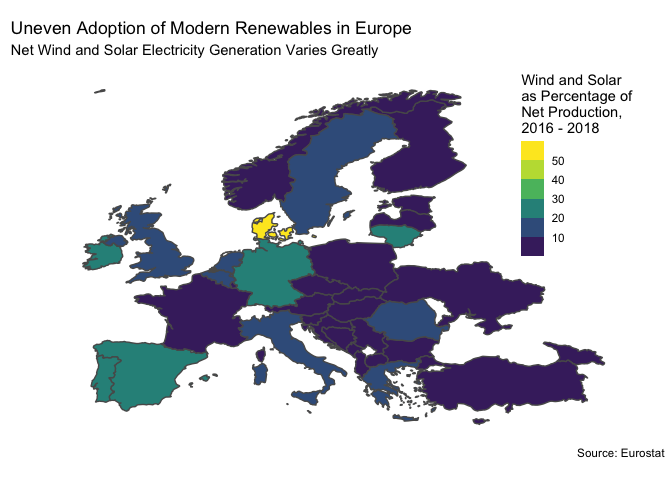

European Energy
================
James Hare
8/3/2020

## European Energy

``` r
#Make countries match in map data and energy data

world <- world %>% 
        rename(country_name = geounit)

country_totals <- country_totals %>% 
        mutate(country_name = case_when(country_name == "North Macedonia" ~ "Macedonia",
                              country_name == "Serbia" ~ "Republic of Serbia",
                              country_name == "Bosnia & Herzegovina" ~ "Bosnia and Herzegovina",
                              country_name == "Czechia" ~ "Czech Republic",
                                  is.na(country_name) ~ "United Kingdom",
                                  TRUE ~ country_name))


#Tidy the data

country_totals_tidy <- country_totals %>% 
         pivot_longer(names_to = "year", 
               values_to = "gwh", 
               cols = "2016":"2018",
               names_transform = list(year = as.integer)) %>%
        group_by(country, country_name, type) %>%
        summarise(gwh = sum(gwh)) %>% 
        
        #calculate percentage of modern renewables (wind and solar)
        
        pivot_wider(names_from = type,
                    values_from = gwh) %>% 
        mutate(total = sum(`Conventional thermal`, Geothermal, Hydro, Nuclear,
                           Other, `Pumped hydro power`, Solar, Wind),
               modern = sum(Solar, Wind),
               pct_modern = (modern / total) * 100) %>% 
        
        #add map data
        left_join(world)
```

    ## `summarise()` regrouping output by 'country', 'country_name' (override with `.groups` argument)

    ## Joining, by = "country_name"

``` r
#plot the data

ggplot(country_totals_tidy) +
        geom_sf(aes(fill = pct_modern, geometry = geometry)) +
         coord_sf(xlim = c(-15, 50), ylim = c(35, 72)) +
        labs(title = "Uneven Adoption of Modern Renewables in Europe",
             subtitle = "Net Wind and Solar Electricity Generation Varies Greatly",
             caption = "Source: Eurostat") +
        theme(legend.position = c(1, 1),
              legend.justification = c(1.2, 1),
              axis.text.x = element_blank(),
              axis.ticks.x = element_blank(),
              axis.text.y = element_blank(),
              axis.ticks.y = element_blank(),
              panel.grid.major = element_blank(), 
              panel.grid.minor = element_blank(),
              panel.background = element_blank()) +
        scale_fill_viridis_b(name = "Wind and Solar\nas Percentage of\nNet Production,\n2016 - 2018")
```

<!-- -->
