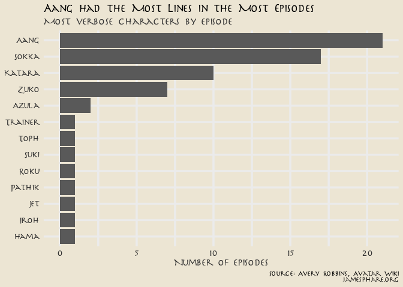
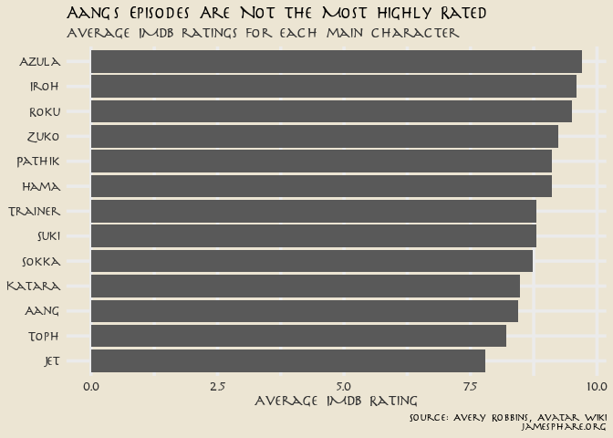

Avatar
================
James P. Hare
4/15/2021

For this [Tidy Tuesday
entry](https://github.com/rfordatascience/tidytuesday/blob/master/data/2020/2020-08-11/readme.md),
I’m looking at data from “Avatar: The Last Airbender”. I was curious if
the central character of each episode (based on number of lines spoken)
correlated with the episode’s IMDB rating. A first step was to determine
the main character for each episode. If Aang speaks the most lines in
nearly every episode then this exercise would be pretty pointless.

<!-- -->

It turns out that—unsurprisingly—Aang speaks more lines in more episodes
than anyone else (21 episodes), followed by Sokka (17), Katara (10),
Zuko (7), and Azula (2). Another eight characters are the focus of one
episode each. So how do the ratings turn out?

<!-- -->

It seems that Azula’s episodes are very well liked while Jet’s get the
lowest ratings. Generally speaking, episodes that focus on characters
who are less central to the series seem to be better liked. Of the major
characters, Zuko gets the highest marks while Aang comes in last.

That’s all for now. Take a look at my code on
[GitHub](https://github.com/jamesphare/tidytuesday/blob/master/20200811/avatar.rmd).
