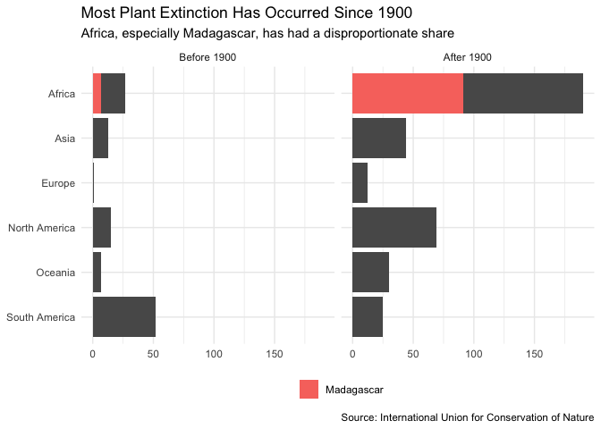
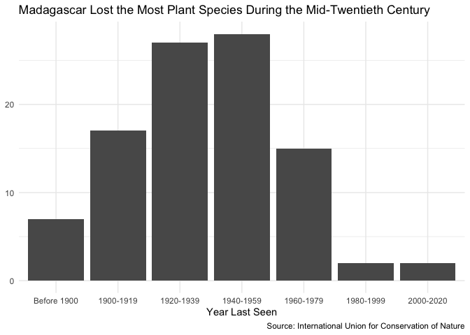
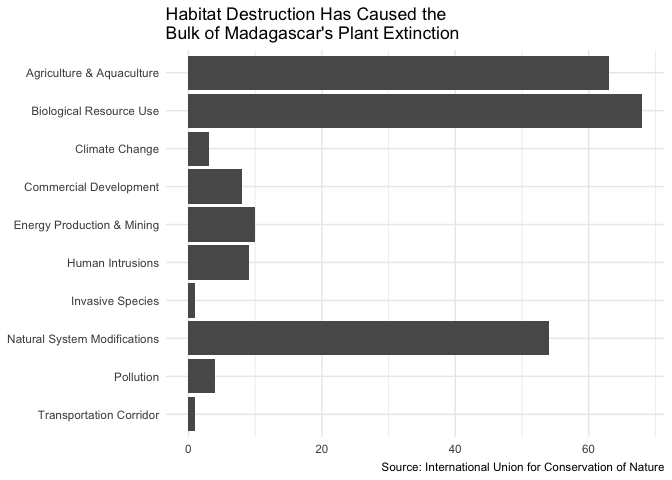

Extinct Plants
================
James Hare
8/18/2020

For this week’s [Tidy
Tuesday](https://github.com/rfordatascience/tidytuesday/blob/master/data/2020/2020-08-18/readme.md),
I’m exploring data from the International Union for Conservation of
Nature on extinct plants, including both species which are totally
extinct and those which survive only under cultivation.

As I explored the data on these 500 species (see my
[notes](https://github.com/jamesphare/tidytuesday/blob/master/20200818/extinct_plants_notes.md)),
a handful of stories leaped out at me that I thought could best be
communicated through simple, bold graphics. The first is how much plant
extinction has taken place in Africa and in Madagascar in particular.

<!-- -->

Then when we focus on Madagascar as the site of so much loss, it becomes
clear that much of this plant extinction took place during the
mid-twentieth century, between 1920 and 1960, corresponding to the final
decades of French colonial rule.

<!-- -->

Finally, the causes of these extinctions are mainly habitat destruction
for agriculture and aquaculture along with biological resource use.
Natural system modifications (which includes things like dam
construction and land reclamation) also contribute to extinctions.

<!-- -->

While Madagascar’s unique flora have faced and continue to face many
threats, it’s hard to look at these data and not see the profound damage
caused by the French colonial regime’s export-driven agricultural
policies.

As usual, my code is available on
[GitHub](https://github.com/jamesphare/tidytuesday/blob/master/20200818/extinct_plants.Rmd).
