Plants in Danger
================
James Hare
8/17/2020

## Extinct Plants

``` r
knitr::opts_chunk$set(echo = TRUE)

#First load needed libraries and this week's data

library(tidyverse)
```

    ## ── Attaching packages ─────────────────────────────────────────── tidyverse 1.3.0 ──

    ## ✓ ggplot2 3.3.2     ✓ purrr   0.3.4
    ## ✓ tibble  3.0.3     ✓ dplyr   1.0.0
    ## ✓ tidyr   1.1.0     ✓ stringr 1.4.0
    ## ✓ readr   1.3.1     ✓ forcats 0.5.0

    ## ── Conflicts ────────────────────────────────────────────── tidyverse_conflicts() ──
    ## x dplyr::filter() masks stats::filter()
    ## x dplyr::lag()    masks stats::lag()

``` r
plants <- readr::read_csv('https://raw.githubusercontent.com/rfordatascience/tidytuesday/master/data/2020/2020-08-18/plants.csv')
```

    ## Parsed with column specification:
    ## cols(
    ##   .default = col_double(),
    ##   binomial_name = col_character(),
    ##   country = col_character(),
    ##   continent = col_character(),
    ##   group = col_character(),
    ##   year_last_seen = col_character(),
    ##   red_list_category = col_character()
    ## )

    ## See spec(...) for full column specifications.

``` r
actions <- readr::read_csv('https://raw.githubusercontent.com/rfordatascience/tidytuesday/master/data/2020/2020-08-18/actions.csv')
```

    ## Parsed with column specification:
    ## cols(
    ##   binomial_name = col_character(),
    ##   country = col_character(),
    ##   continent = col_character(),
    ##   group = col_character(),
    ##   year_last_seen = col_character(),
    ##   red_list_category = col_character(),
    ##   action_type = col_character(),
    ##   action_taken = col_double()
    ## )

``` r
threats <- readr::read_csv('https://raw.githubusercontent.com/rfordatascience/tidytuesday/master/data/2020/2020-08-18/threats.csv')
```

    ## Parsed with column specification:
    ## cols(
    ##   binomial_name = col_character(),
    ##   country = col_character(),
    ##   continent = col_character(),
    ##   group = col_character(),
    ##   year_last_seen = col_character(),
    ##   red_list_category = col_character(),
    ##   threat_type = col_character(),
    ##   threatened = col_double()
    ## )

``` r
#Then wrangle the data

year_levels <- c("Before 1900", "1900-1919", "1920-1939", "1940-1959", 
                  "1960-1979", "1980-1999","2000-2020")

plants <- plants %>% 
        mutate(year_last_seen = factor(year_last_seen, levels = year_levels))

threats <- threats %>% 
        mutate(year_last_seen = factor(year_last_seen, levels = year_levels)) %>%
        filter(threatened == 1)
        
actions <- actions %>% 
        mutate(year_last_seen = factor(year_last_seen, levels = year_levels)) %>%
        filter(action_taken == 1)
```

Let’s start by visualizing the data in various ways to see if we can
find anything interesting.

``` r
plants %>% 
        ggplot(aes(year_last_seen)) +
        geom_bar() +
        coord_flip()
```

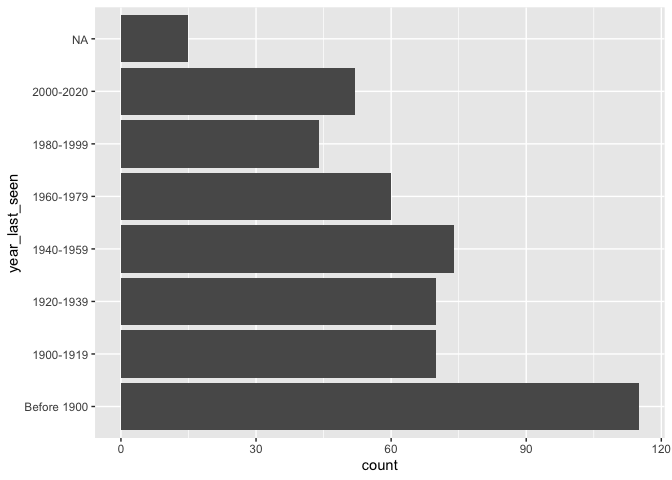<!-- -->

``` r
plants %>% 
        ggplot(aes(year_last_seen, fill = continent)) +
        geom_bar(position = "dodge") +
        coord_flip()
```

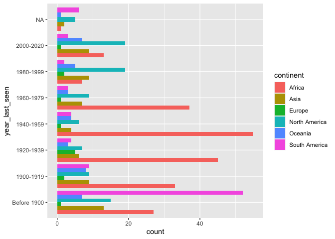<!-- -->

``` r
plants %>%
        filter(!(is.na(year_last_seen))) %>% 
        group_by(year_last_seen, continent) %>% 
        count() %>% 
        ggplot(aes(year_last_seen, n, group = continent)) +
        geom_line(aes(color = continent))
```

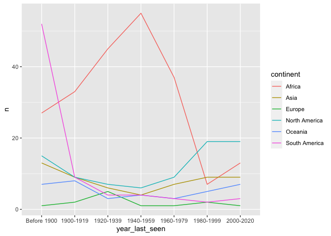<!-- -->

``` r
plants %>% 
        ggplot(aes(year_last_seen)) +
        geom_bar() +
        facet_wrap(~ continent) +
        coord_flip()
```

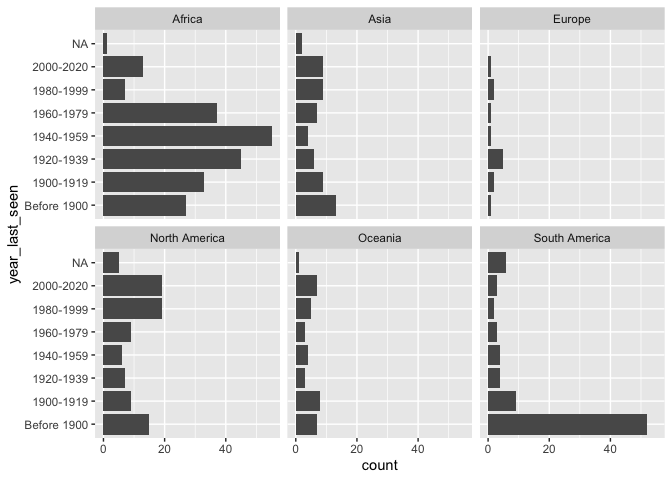<!-- -->

``` r
threats %>% 
        ggplot(aes(year_last_seen, fill = threat_type)) +
        geom_bar(position = "dodge") +
        coord_flip()
```

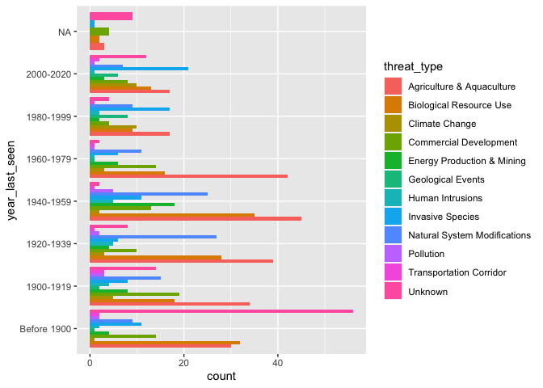<!-- -->

``` r
threats %>%
        filter(!(is.na(year_last_seen))) %>% 
        group_by(year_last_seen, threat_type) %>% 
        count() %>% 
        ggplot(aes(year_last_seen, n, group = threat_type)) +
        geom_line(aes(color = threat_type))
```

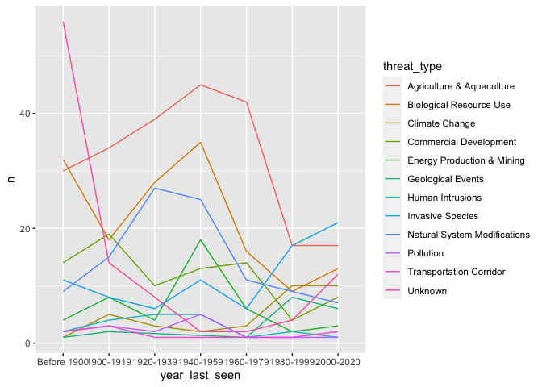<!-- -->

``` r
actions %>% 
        ggplot(aes(year_last_seen, fill = action_type)) +
        geom_bar(position = "dodge") +
        coord_flip()
```

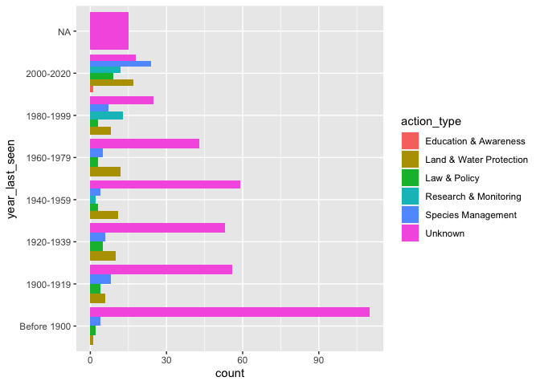<!-- -->

``` r
actions %>%
        filter(!(is.na(year_last_seen))) %>% 
        group_by(year_last_seen, action_type) %>% 
        count() %>% 
        ggplot(aes(year_last_seen, n, group = action_type)) +
        geom_line(aes(color = action_type))
```

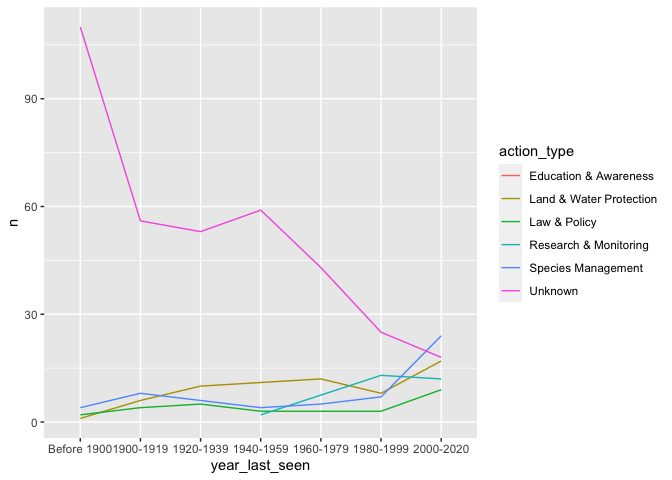<!-- -->

``` r
threats %>%
        filter(threatened == 1) %>% 
        group_by(continent, threat_type) %>% 
        count() %>%
        ggplot(aes(threat_type, n)) +
        geom_col() +
        facet_wrap(~ continent) +
        coord_flip()
```

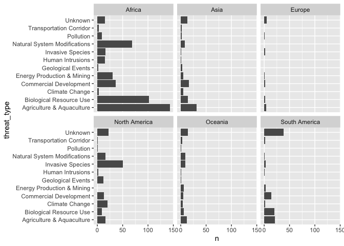<!-- -->

``` r
#A lot of plant extinction has happened in Africa. How much of this is Madagascar (which accounts for 19.6% of extinct plant species)

plants %>% 
        filter(continent == "Africa") %>% 
        count()
```

    ## # A tibble: 1 x 1
    ##       n
    ##   <int>
    ## 1   218

``` r
plants %>% filter(country == "Madagascar") %>% 
        count()
```

    ## # A tibble: 1 x 1
    ##       n
    ##   <int>
    ## 1    98

``` r
#So 218 out of 500 extinct plant species are from Africa and 98 of these are from Madagascar

#Let's try narrowing our focus to Africa and Madagascar to see if we can say anything interesting about the data

threats %>% 
        filter(continent == "Africa",
               threatened == 1) %>%
        group_by(year_last_seen, threat_type) %>% 
        count() %>% 
        ggplot(aes(year_last_seen, n)) +
        geom_col(aes(fill = threat_type), position = "dodge")
```

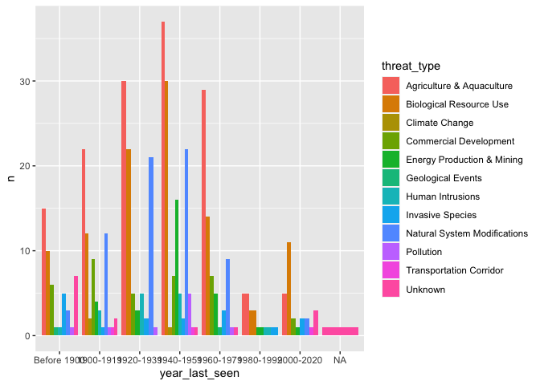<!-- -->

``` r
threats %>% 
        filter(country == "Madagascar",
               threatened == 1) %>%
        group_by(year_last_seen, threat_type) %>% 
        count() %>% 
        ggplot(aes(year_last_seen, n)) +
        geom_col(aes(fill = threat_type), position = "dodge")
```

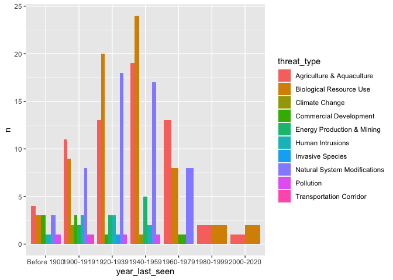<!-- -->

``` r
threats %>% 
        filter(continent == "Africa") %>% 
        ggplot(aes(threat_type)) +
        geom_bar() +
        coord_flip()
```

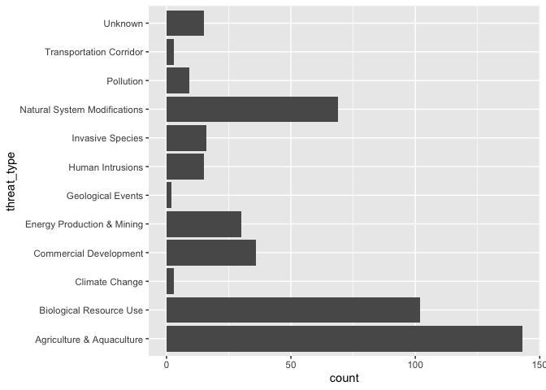<!-- -->

``` r
threats %>% 
        filter(country == "Madagascar") %>% 
        ggplot(aes(threat_type)) +
        geom_bar() +
        coord_flip()
```

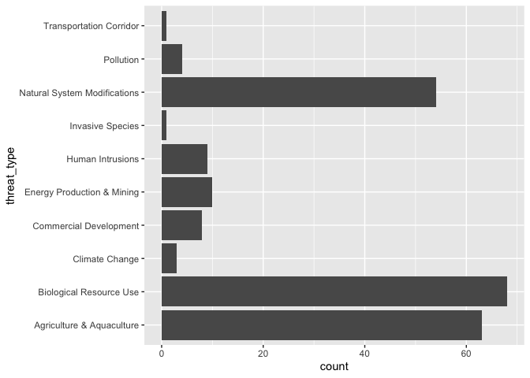<!-- -->

``` r
plants  %>%  
        filter(continent == "Africa") %>%
        group_by(year_last_seen) %>% 
        count() %>% 
        ggplot(aes(year_last_seen, n)) +
        geom_col()
```

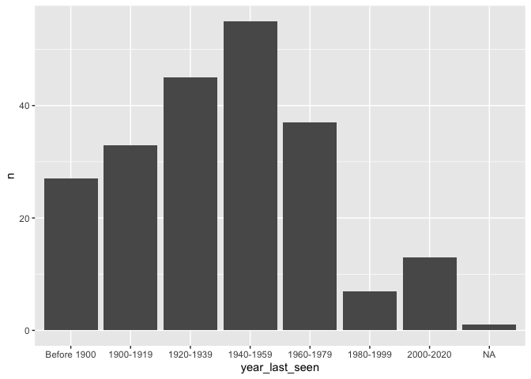<!-- -->

``` r
plants  %>%  
        filter(country == "Madagascar") %>%
        group_by(year_last_seen) %>% 
        count() %>% 
        ggplot(aes(year_last_seen, n)) +
        geom_col()
```

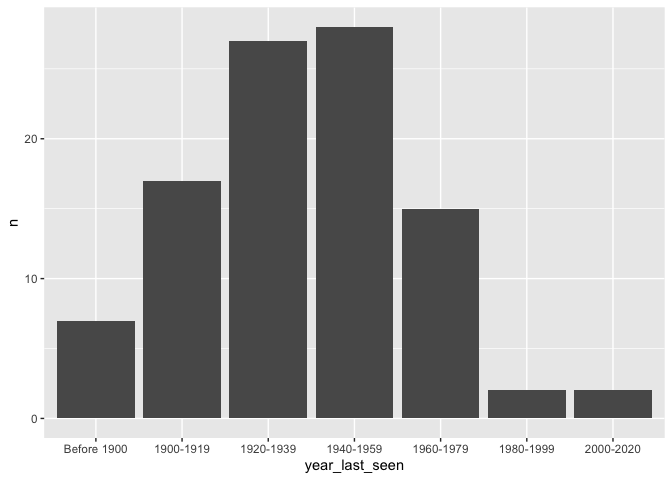<!-- -->

``` r
actions %>% 
        filter(continent == "Africa",
               action_taken == 1) %>%
        group_by(year_last_seen, action_type) %>% 
        count() %>% 
        ggplot(aes(year_last_seen, n)) +
        geom_col(aes(fill = action_type), position = "dodge")
```

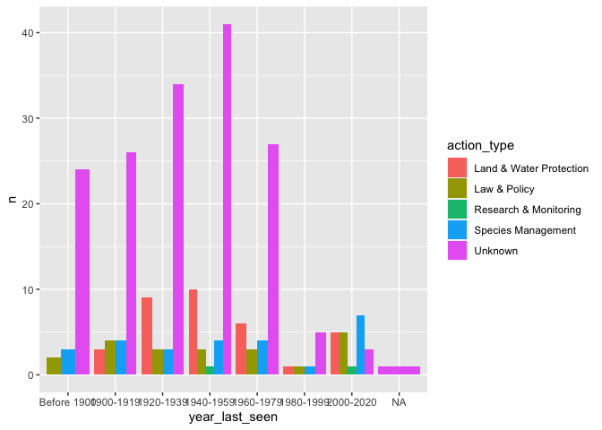<!-- -->

``` r
actions %>% 
        filter(country == "Madagascar",
               action_taken == 1) %>%
        group_by(year_last_seen, action_type) %>% 
        count() %>% 
        ggplot(aes(year_last_seen, n)) +
        geom_col(aes(fill = action_type), position = "dodge")
```

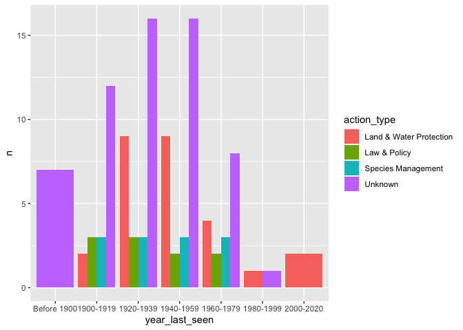<!-- -->

I also tried mapping some of the data, but sorting the data by country
isn’t that interesting and perhaps deceptive; although, it does show
that islands are the site of many plant extinctions.

So the stories I see here that are worth telling is how much plant
extinction has taken place in Africa and Madagascar in particular, how
much of this took place during the mid-twentieth century, and how much
of it is due to “Agriculture and Aquaculture” and “Biological Resource
Use” (and to a slightly lesser degree “Natural System Modifications”).
It’s also interesting how much loss occurred in South America prior to
1900. So now let’s figure out how to tell this story visually.

``` r
#Define shared plot aesthetic
theme_set(theme_minimal())

centuries <- c("Before 1900", "After 1900")
countries <- c("Not Madagascar", "Madagascar")

plants %>% 
        filter(!(is.na(year_last_seen))) %>%
        mutate(pre1900 = if_else(year_last_seen == "Before 1900", 
                                 "Before 1900", "After 1900"),
               pre1900 = factor(pre1900, levels = centuries),
               madagascar = if_else(country == "Madagascar", "Madagascar", 
                                    NULL)
                       ) %>%
ggplot(aes(reorder(continent, desc(continent)), fill = madagascar)) +
        geom_bar() +
        facet_wrap(~ pre1900) +
        coord_flip() +
        labs(x = NULL,
             y = NULL,
             title = "Most Plant Extinction Has Occurred Since 1900",
             subtitle = "Africa, especially Madagascar, has had a disproportionate share",
             caption = "Source: International Union for Conservation of Nature"
             ) +
        theme(legend.position = "bottom",
              legend.title = element_blank())
```

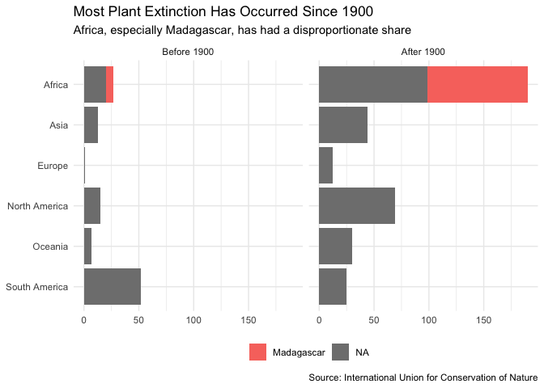<!-- -->
