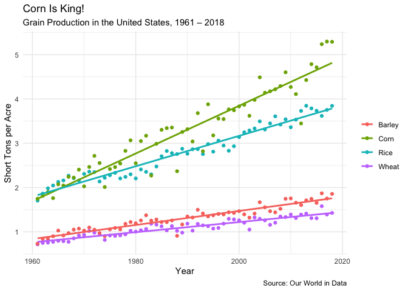

Global Crop Yields
================
James Hare
9/1/2020

<!-- -->

This week’s [Tidy
Tuesday](https://github.com/rfordatascience/tidytuesday/blob/fef6e442ac38e55edbdd91c1c19736f5ccdb9579/data/2020/2020-09-01/readme.md)
presented *a lot* of data with many potential stories to tell. I decided
to narrow in on grain production in the United States. I also decided to
Americanize names and measurements because who really knows what tonnes
of maize per hectare means? I used Commonwealth spellings in the code
(which is available [here](global_crop_yields.Rmd)) just to be
inconsistent.
