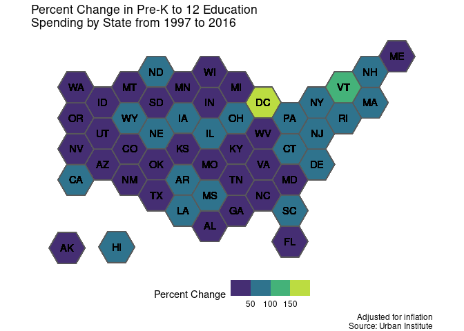

US Spending on Kids
================
James P. Hare
9/14/2020

``` r
PK12_spending <- kids %>%
        filter(year == 2016,
               variable == "PK12ed")

#modify code from https://github.com/kaerosen/tilemaps/blob/master/data-raw/governors.R to include DC
states <- spData::us_states[,c("NAME", "geometry")]
states <- states[order(states$NAME),]
states$abbreviation <- c("AL", "AZ", "AR", "CA", "CO", "CT", "DE", "DC", "FL",
                            "GA", "ID", "IL", "IN", "IA", "KS", "KY", "LA",
                            "ME", "MD", "MA", "MI", "MN", "MS", "MO", "MT",
                            "NE", "NV", "NH", "NJ", "NM", "NY", "NC", "ND",
                            "OH", "OK", "OR", "PA", "RI", "SC", "SD", "TN",
                            "TX", "UT", "VT", "VA", "WA", "WV", "WI", "WY")
states <- sf::st_transform(states, 3857)
```

``` r
states <- states %>%
  mutate(tile_map = generate_map(geometry, square = FALSE, flat_topped = TRUE))

all_states <- states %>% 
  add_row(NAME = "Alaska", abbreviation = "AK",
          tile_map = create_island(states$tile_map, "lower left")) %>%
  add_row(NAME = "Hawaii", abbreviation = "HI",
          tile_map = create_island(states$tile_map, c(-12050000, 3008338))) %>% 
  left_join(PK12_spending, by = c("NAME" = "state"))

ggplot(all_states) +
  geom_sf(aes(geometry = tile_map, fill = inf_adj_perchild)) +
  geom_sf_text(aes(geometry = tile_map, label = abbreviation),
               fun.geometry = function(x) st_centroid(x)) +
  theme_void()
```

<!-- -->
