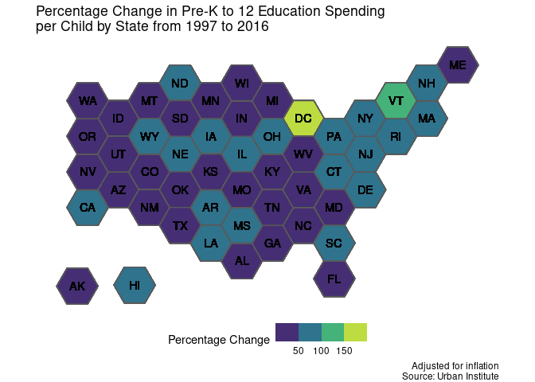

US Spending on Kids
================
James P. Hare
9/15/2020

``` r
knitr::opts_chunk$set(echo = TRUE)

library(tidyverse)
```

    ## ── Attaching packages ────────────────────────────────────────────────────────────────────────────────────────────────────────────────────────────────────── tidyverse 1.3.0 ──

    ## ✓ ggplot2 3.3.2     ✓ purrr   0.3.4
    ## ✓ tibble  3.0.3     ✓ dplyr   1.0.2
    ## ✓ tidyr   1.1.2     ✓ stringr 1.4.0
    ## ✓ readr   1.3.1     ✓ forcats 0.5.0

    ## ── Conflicts ───────────────────────────────────────────────────────────────────────────────────────────────────────────────────────────────────────── tidyverse_conflicts() ──
    ## x dplyr::filter() masks stats::filter()
    ## x dplyr::lag()    masks stats::lag()

``` r
library(tilemaps)
library(sf)
```

    ## Linking to GEOS 3.8.0, GDAL 3.0.4, PROJ 6.3.1

``` r
kids <-
  readr::read_csv(
    'https://raw.githubusercontent.com/rfordatascience/tidytuesday/master/data/2020/2020-09-15/kids.csv',
    col_types = cols(
      state = col_character(),
      variable = col_character(),
      year = col_factor(),
      raw = col_double(),
      inf_adj = col_double(),
      inf_adj_perchild = col_double()
    )
  )
```

``` r
PK12_spending <- kids %>%
  filter(variable == "PK12ed") %>%
  group_by(state) %>%
  mutate(percentage_change = (((inf_adj_perchild[year == 2016] - inf_adj_perchild[year == 1997])/
                               inf_adj_perchild[year == 1997]) * 100)) %>%
  select(state, percentage_change)

#modify code from https://github.com/kaerosen/tilemaps/blob/master/data-raw/governors.R to include DC
#rewrite code to Tidyverse style
states <- spData::us_states[, c("NAME", "geometry")] %>%
  arrange(NAME) %>%
  mutate(
    abbreviation =   c(
      "AL",
      "AZ",
      "AR",
      "CA",
      "CO",
      "CT",
      "DE",
      "DC",
      "FL",
      "GA",
      "ID",
      "IL",
      "IN",
      "IA",
      "KS",
      "KY",
      "LA",
      "ME",
      "MD",
      "MA",
      "MI",
      "MN",
      "MS",
      "MO",
      "MT",
      "NE",
      "NV",
      "NH",
      "NJ",
      "NM",
      "NY",
      "NC",
      "ND",
      "OH",
      "OK",
      "OR",
      "PA",
      "RI",
      "SC",
      "SD",
      "TN",
      "TX",
      "UT",
      "VT",
      "VA",
      "WA",
      "WV",
      "WI",
      "WY"
    )
  ) %>% 
sf::st_transform(3857) %>%
  mutate(tile_map = generate_map(geometry, square = FALSE, flat_topped = TRUE))

states <- states %>%
  add_row(
    NAME = "Alaska",
    abbreviation = "AK",
    tile_map = create_island(states$tile_map, "lower left")
  ) %>%
  add_row(
    NAME = "Hawaii",
    abbreviation = "HI",
    tile_map = create_island(states$tile_map, c(-12050000, 3008338))
  ) %>%
  arrange(NAME)

states <- states %>%
  left_join(PK12_spending, by = c("NAME" = "state"))

remove(kids)
remove(PK12_spending)
```

``` r
ggplot(states) +
  geom_sf(aes(geometry = tile_map, fill = percentage_change)) +
  geom_sf_text(
    aes(geometry = tile_map, label = abbreviation),
    fun.geometry = function(x)
      st_centroid(x)
  ) +
  labs(
    title = "Percentage Change in Pre-K to 12 Education Spending\nper Child by State from 1997 to 2016",
    caption = "Adjusted for inflation\nSource: Urban Institute",
    fill = "Percentage Change"
  ) +
  scale_fill_viridis_b() +
  theme_void() +
  theme(legend.position = "bottom")
```

<!-- -->
