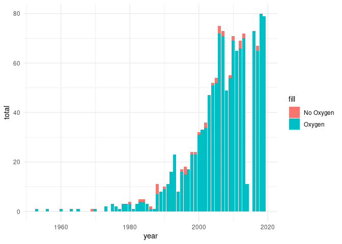

Himalayan Climbing Expeditions
================
James P. Hare
9/23/2020

<https://github.com/rfordatascience/tidytuesday/blob/master/data/2020/2020-09-22/readme.md>

<https://www.alexcookson.com/post/how-dangerous-is-climbing-mount-everest/>

``` r
knitr::opts_chunk$set(echo = TRUE)

library(tidyverse)
```

    ## ── Attaching packages ───────────────────────────────────────────────────────────────────────────────────────────── tidyverse 1.3.0 ──

    ## ✓ ggplot2 3.3.2     ✓ purrr   0.3.4
    ## ✓ tibble  3.0.3     ✓ dplyr   1.0.2
    ## ✓ tidyr   1.1.2     ✓ stringr 1.4.0
    ## ✓ readr   1.3.1     ✓ forcats 0.5.0

    ## ── Conflicts ──────────────────────────────────────────────────────────────────────────────────────────────── tidyverse_conflicts() ──
    ## x dplyr::filter() masks stats::filter()
    ## x dplyr::lag()    masks stats::lag()

``` r
theme_set(theme_minimal())

members <- readr::read_csv('https://raw.githubusercontent.com/rfordatascience/tidytuesday/master/data/2020/2020-09-22/members.csv')
```

    ## Parsed with column specification:
    ## cols(
    ##   .default = col_character(),
    ##   year = col_double(),
    ##   age = col_double(),
    ##   hired = col_logical(),
    ##   highpoint_metres = col_double(),
    ##   success = col_logical(),
    ##   solo = col_logical(),
    ##   oxygen_used = col_logical(),
    ##   died = col_logical(),
    ##   death_height_metres = col_double(),
    ##   injured = col_logical(),
    ##   injury_height_metres = col_double()
    ## )

    ## See spec(...) for full column specifications.

``` r
expeditions <- readr::read_csv('https://raw.githubusercontent.com/rfordatascience/tidytuesday/master/data/2020/2020-09-22/expeditions.csv')
```

    ## Parsed with column specification:
    ## cols(
    ##   expedition_id = col_character(),
    ##   peak_id = col_character(),
    ##   peak_name = col_character(),
    ##   year = col_double(),
    ##   season = col_character(),
    ##   basecamp_date = col_date(format = ""),
    ##   highpoint_date = col_date(format = ""),
    ##   termination_date = col_date(format = ""),
    ##   termination_reason = col_character(),
    ##   highpoint_metres = col_double(),
    ##   members = col_double(),
    ##   member_deaths = col_double(),
    ##   hired_staff = col_double(),
    ##   hired_staff_deaths = col_double(),
    ##   oxygen_used = col_logical(),
    ##   trekking_agency = col_character()
    ## )

``` r
peaks <- readr::read_csv('https://raw.githubusercontent.com/rfordatascience/tidytuesday/master/data/2020/2020-09-22/peaks.csv')
```

    ## Parsed with column specification:
    ## cols(
    ##   peak_id = col_character(),
    ##   peak_name = col_character(),
    ##   peak_alternative_name = col_character(),
    ##   height_metres = col_double(),
    ##   climbing_status = col_character(),
    ##   first_ascent_year = col_double(),
    ##   first_ascent_country = col_character(),
    ##   first_ascent_expedition_id = col_character()
    ## )

"What is the composition of expeditions? For example, how big do they
tend to be and what proportion consist of hired staff?

``` r
everest_expeditions <- expeditions %>% 
        filter(peak_id == "EVER") %>% 
        mutate(size_group = members + hired_staff) %>% 
        group_by(year) %>% 
        summarise(avg_staff = mean (hired_staff),
                  avg_members = mean(members),
                  avg_size = mean(size_group)
                  ) %>% 
        mutate(prop_staff = avg_staff / avg_size)
```

    ## `summarise()` ungrouping output (override with `.groups` argument)

``` r
everest_expeditions %>% 
        ggplot(aes(year, avg_size)) +
        geom_col()
```

<!-- -->

``` r
everest_expeditions %>% 
        ggplot(aes(year, prop_staff)) +
        geom_col()
```

    ## Warning: Removed 2 rows containing missing values (position_stack).

<!-- -->

“What injuries are associated with climbing Everest?”

``` r
members %>% 
        filter(peak_id == "EVER",
               injured == TRUE) %>%
        group_by(injury_type) %>% 
        count() %>% 
        ggplot(aes(x = reorder(injury_type, n), y = n)) +
        geom_col() +
        coord_flip()
```

<!-- -->

“Are there characteristics of climbers associated with higher or lower
death rates? For example, are Sherpas – presumably well-acclimated to
high altitudes – less likely to suffer from AMS?”

Let’s tackle the example question first. First let’s take a look at how
Sherpas die on Everest.

``` r
# Hired staff here seems to be a rough stand-in for what is meant by Sherpa. 
# I'm not sure what the one Belgian is doing on this list, but they're not among
# the deaths, so I think we're pretty safe using this definition.

members %>% 
        filter(hired == TRUE) %>% 
        group_by(citizenship) %>% 
        count() %>% 
        arrange(desc(n))
```

    ## # A tibble: 10 x 2
    ## # Groups:   citizenship [10]
    ##    citizenship         n
    ##    <chr>           <int>
    ##  1 Nepal           15071
    ##  2 China             563
    ##  3 India              76
    ##  4 <NA>                7
    ##  5 India/Nepal         4
    ##  6 Nepal/India?        4
    ##  7 India?              3
    ##  8 Belgium             1
    ##  9 Nepal/Australia     1
    ## 10 Nepal/India         1

``` r
sherpa_deaths <- members %>% 
        filter(peak_id =="EVER",
               hired == TRUE,
               died == TRUE) %>%
        group_by(death_cause) %>% 
        count() %>% 
        arrange(desc(n))

sherpa_deaths
```

    ## # A tibble: 10 x 2
    ## # Groups:   death_cause [10]
    ##    death_cause              n
    ##    <chr>                <int>
    ##  1 Avalanche               56
    ##  2 Fall                    17
    ##  3 Icefall collapse        13
    ##  4 Illness (non-AMS)       10
    ##  5 AMS                      9
    ##  6 Crevasse                 7
    ##  7 Falling rock / ice       3
    ##  8 Other                    3
    ##  9 Exhaustion               1
    ## 10 Exposure / frostbite     1

Now let’s look at how non-Sherpas die on Everest.

``` r
non_sherpa_deaths <- members %>% 
        # So non-Sherpa here means everyone except Nepalese citizens working as hired staff
        filter(peak_id =="EVER",
               died == TRUE,
               hired == FALSE
        ) %>% 
        group_by(death_cause) %>% 
        count() %>% 
        arrange(desc(n))

non_sherpa_deaths
```

    ## # A tibble: 11 x 2
    ## # Groups:   death_cause [11]
    ##    death_cause                     n
    ##    <chr>                       <int>
    ##  1 Fall                           54
    ##  2 AMS                            27
    ##  3 Exhaustion                     25
    ##  4 Exposure / frostbite           25
    ##  5 Avalanche                      21
    ##  6 Illness (non-AMS)              15
    ##  7 Disappearance (unexplained)     9
    ##  8 Crevasse                        4
    ##  9 Icefall collapse                2
    ## 10 Other                           2
    ## 11 Unknown                         2

So among deaths on Everest, Sherpas, who are required to spend much more
time in dangerous zones, are much more likely to die in avalanches while
non-Sherpas, who are presumably less well acclimated to the altitude,
face a greater risk of AMS.

Out of 120 Sherpa deaths on Everest, 56 (46.7%) died in avalanches while
9 (7.5%) died from AMS.

Out of 186 non-Sherpa deaths, 27 (14.5%) died from AMS. The most common
cause of death for non-Sherpas was falling. 54 of these climbers (29%)
died from falls.

``` r
members %>% 
        group_by(hired) %>% 
        count()
```

    ## # A tibble: 2 x 2
    ## # Groups:   hired [2]
    ##   hired     n
    ##   <lgl> <int>
    ## 1 FALSE 60788
    ## 2 TRUE  15731

However, if we look at it based on total number of climbers, then the
risk of death from altitude sickness is actually marginally worse for
Sherpas than non-Sherpas, meaning that Sherpas are facing a comparable
risk from the altitude as well as much greater risks from avalanches and
other dangers.

“What are the general trends in solo expeditions and the use of oxygen?”

``` r
everest_solo <- expeditions %>%
        filter(peak_id == "EVER") %>% 
        mutate(solo = case_when((members == 1 & hired_staff == 0) ~ TRUE,
                         (members != 1 | hired_staff != 0) ~ FALSE)) %>% 
        group_by(year) %>% 
        summarise(solo = sum(solo),
                  total = n()) %>% 
        mutate(solo_prop = solo / total)
```

    ## `summarise()` ungrouping output (override with `.groups` argument)

``` r
everest_solo %>% 
        ggplot(aes(year, solo)) +
        geom_col()
```

<!-- -->

``` r
everest_solo %>% 
        ggplot(aes(year, solo_prop)) +
        geom_col()
```

<!-- -->

``` r
everest_o2 <- expeditions %>%
        filter(peak_id == "EVER") %>%  
        group_by(year) %>% 
        summarise(o2 = sum(oxygen_used),
                  total = n()) %>% 
        mutate(o2_prop = o2 / total)
```

    ## `summarise()` ungrouping output (override with `.groups` argument)

``` r
everest_o2 %>% 
        ggplot(aes(year, o2)) +
        geom_col()
```

<!-- -->

``` r
everest_o2 %>% 
        ggplot(aes(year, total)) +
        geom_col()
```

<!-- -->

``` r
everest_o2 %>% 
        ggplot(aes(year, o2_prop)) +
        geom_col()
```

<!-- -->
