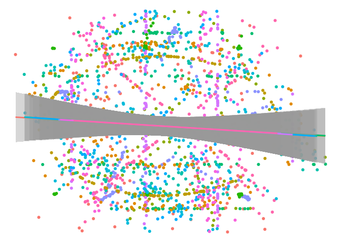
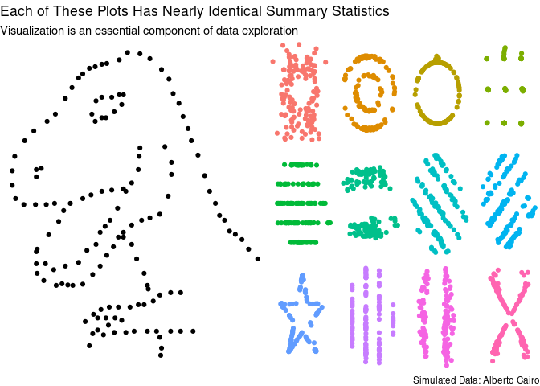

Datasaurus
================
James P. Hare
10/13/2020

    ## Rows: 1,846
    ## Columns: 3
    ## $ dataset <chr> "dino", "dino", "dino", "dino", "dino", "dino", "dino", "dino…
    ## $ x       <dbl> 55.3846, 51.5385, 46.1538, 42.8205, 40.7692, 38.7179, 35.6410…
    ## $ y       <dbl> 97.1795, 96.0256, 94.4872, 91.4103, 88.3333, 84.8718, 79.8718…

    ##    dataset                x               y           
    ##  Length:1846        Min.   :15.56   Min.   : 0.01512  
    ##  Class :character   1st Qu.:41.07   1st Qu.:22.56107  
    ##  Mode  :character   Median :52.59   Median :47.59445  
    ##                     Mean   :54.27   Mean   :47.83510  
    ##                     3rd Qu.:67.28   3rd Qu.:71.81078  
    ##                     Max.   :98.29   Max.   :99.69468

    ## `summarise()` ungrouping output (override with `.groups` argument)

    ## # A tibble: 13 x 6
    ##    dataset    Mean_X Mean_Y  SD_X  SD_Y    Corr
    ##    <chr>       <dbl>  <dbl> <dbl> <dbl>   <dbl>
    ##  1 away         54.3   47.8  16.8  26.9 -0.0641
    ##  2 bullseye     54.3   47.8  16.8  26.9 -0.0686
    ##  3 circle       54.3   47.8  16.8  26.9 -0.0683
    ##  4 dino         54.3   47.8  16.8  26.9 -0.0645
    ##  5 dots         54.3   47.8  16.8  26.9 -0.0603
    ##  6 h_lines      54.3   47.8  16.8  26.9 -0.0617
    ##  7 high_lines   54.3   47.8  16.8  26.9 -0.0685
    ##  8 slant_down   54.3   47.8  16.8  26.9 -0.0690
    ##  9 slant_up     54.3   47.8  16.8  26.9 -0.0686
    ## 10 star         54.3   47.8  16.8  26.9 -0.0630
    ## 11 v_lines      54.3   47.8  16.8  26.9 -0.0694
    ## 12 wide_lines   54.3   47.8  16.8  26.9 -0.0666
    ## 13 x_shape      54.3   47.8  16.8  26.9 -0.0656

    ## # A tibble: 26 x 6
    ##    dataset term        estimate std.error statistic  p.value
    ##    <chr>   <chr>          <dbl>     <dbl>     <dbl>    <dbl>
    ##  1 dino    (Intercept)  53.5        7.69      6.95  1.29e-10
    ##  2 dino    x            -0.104      0.136    -0.764 4.46e- 1
    ##  3 away    (Intercept)  53.4        7.69      6.94  1.31e-10
    ##  4 away    x            -0.103      0.135    -0.760 4.48e- 1
    ##  5 h_lines (Intercept)  53.2        7.70      6.91  1.53e-10
    ##  6 h_lines x            -0.0992     0.136    -0.732 4.66e- 1
    ##  7 v_lines (Intercept)  53.9        7.69      7.01  9.38e-11
    ##  8 v_lines x            -0.112      0.135    -0.824 4.12e- 1
    ##  9 x_shape (Intercept)  53.6        7.69      6.97  1.17e-10
    ## 10 x_shape x            -0.105      0.135    -0.778 4.38e- 1
    ## # … with 16 more rows

<!-- -->

<!-- -->
