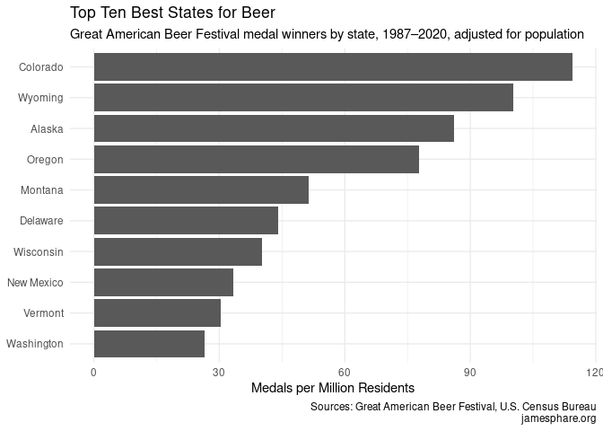

Beer Awards
================
James P. Hare
10/26/2020

I missed last week’s [Tidy
Tuesday](https://github.com/rfordatascience/tidytuesday/blob/master/data/2020/2020-10-20/readme.md),
but it’s about beer, so I wanted to come back to it. Many
[lists](https://beerconnoisseur.com/articles/all-50-states-ranked-beer)
celebrate California as the best state for beer, and there is no doubt
that some delicious beer comes out of California. Indeed, between 1987
and 2020, California brewers have won more medals than any other state
at the Great American Beer Festival.

But California is also the largest state by population, so it’s not
surprising that there are many brewers there winning many medals. What
if we give small states a chance and rank them by how may medals their
brewers take home *per capita*?

It turns out that California drops to a still respectable number eleven,
leaving behind a reshuffled top ten where undisputed powerhouses like
Colorado and Wisconsin are joined by thinly populated states like
Wyoming and Alaska.

I’m not sure if counting medals—whether or not we adjust for
population—is the best way to judge which state has the best beer.
Clearly, the only fair way to resolve this dispute is to drink all the
best beers from every state and then decide, so I guess I have my work
cut out for me.

<!-- -->

Source code on
[GitHub](https://github.com/jamesphare/tidytuesday/blob/master/20201020/beer_awards.Rmd).
