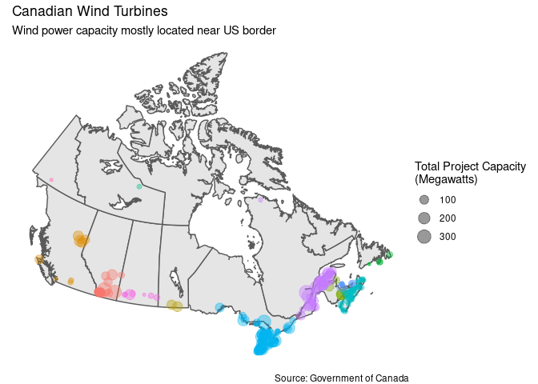

Canadian Wind Turbines
================
James P. Hare
10/27/2020

This week’s [Tidy
Tuesday](https://github.com/rfordatascience/tidytuesday/blob/master/data/2020/2020-10-27/readme.md)
provides data on wind turbines across Canada. Seems like it would be fun
(and perhaps informative) to make a map\!

<!-- -->

Source code available on
[GitHub](https://github.com/jamesphare/tidytuesday/blob/master/20201027/wind_turbines.Rmd).
